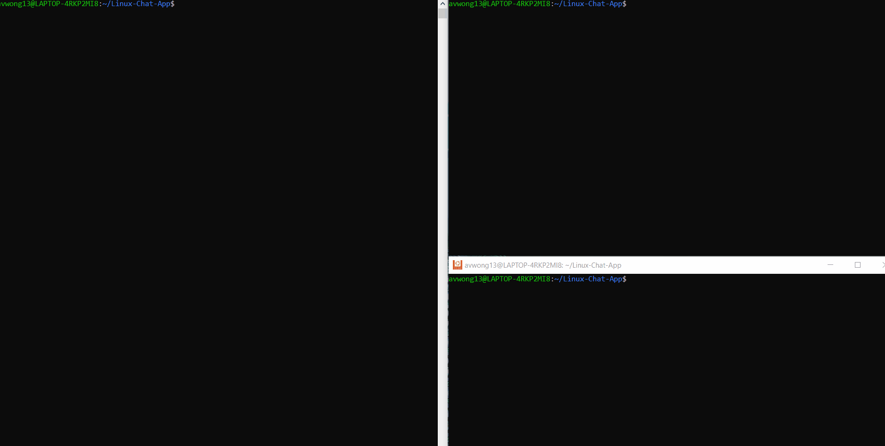

# Linux-Chat-App

## Summary

Simple cli-client and server in-memory chat application implemented in Go and grpc.

## Design Document

1. What kind of chat app will it be?

    it will support 1 on 1 and group chats

2. what is the group chat limit?

    100

3. Security?

    oppenssl certs

## High-level design

* services

```
+------------------+                   +-------------------+                     +--------------------+
|                  |                   |                   |                     |                    |
|                  |                   |                   |                     |                    |
|                  |                   |                   |                     |                    |
|                  |    Messsage       |                   |      Message        |                    |
|     Sender       +------------------->    Chat Server    +-------------------->|       Receiver     |
|                  |                   |                   |                     |                    |
|                  |                   |                   |                     |                    |
|                  |                   |                   |                     |                    |
|                  |                   |                   |                     |                    |
+------------------+                   +-------------------+                     +--------------------+

```
* data

```
     users                                                     chatRooms
+--------------------+                                    +--------------------+
|  array:            |                                    |   array:           |
|  +-------------+   |                                    |  +---------------+ |
|  | userName    |   |       chatRooms has chatroom       |  | chatRoomName  | |
|  | chatRooms   +---+----------------------------------->|  | users         | |
|  +-------------+   |      users has user                |  |               | |
|                    |<-----------------------------------+--+---------------+ |
|                    |                                    |                    |
|                    |                                    |                    |
|                    |                                    |                    |
|                    |                                    |                    |
|                    |                                    |                    |
+--------------------+                                    +--------------------+
```

* Messages Flow

```
+-----------------------+                         +---------------------+                 +-----------------------+
|                       |                         |                     |                 |                       |
|                       |                         |                     |                 |                       |
|     user              |                         |   chat service      |                 |     dataStore         |
|                       |      send message       |                     |  add message    |                       |
|                       +-------------------------+>                    +---------------->|                       |
|                       |                         |                     |                 |                       |
|                       |                         |                     |                 |                       |
|                       |                         |                     |                 |                       |
|                       |                         |                     |                 |                       |
+-----------------------+                         +---------------------+                 +-----------+-----------+
                                                                                                      |
                                                                                                      |
                                                                                                      |
                                                                                                      |
                                                                                                      |
                                                                                          +-----------v--------------+
                                                                                          |                          |
                                                                                          |                          |
                                                                                          |                          |
                                                                 sends out messages to users  messageQueue           |
                                                                                          |                          |
                                                               <--------------------------+                          |
                                                                                          |                          |
                                                                                          |                          |
                                                                                          |                          |
                                                                                          +--------------------------+
```

## Usage

### Server

* to run server, run the following command in root dir of project:
```
make run-server
```

### client

* to run client, run the following command in root dir of project:
```
make run-client
```

* help command:

```
avwong13@LAPTOP-4RKP2MI8:~/Linux-Chat-App$ make run-client
go run cmd/client/clientMain.go
please Create UserName:
u1
Attempting to create user: u1
Username: u1 created successfully!
u1: help

Commands:
viewChatRooms: get a list of available chatRooms
viewUsers: get a list of users logged into server
createChatRoom: create chatroom
joinChatRoom: join chatrooom
leaveChatRoom: leave chatRoom
send: send message to chat service
```
## Sample Run


